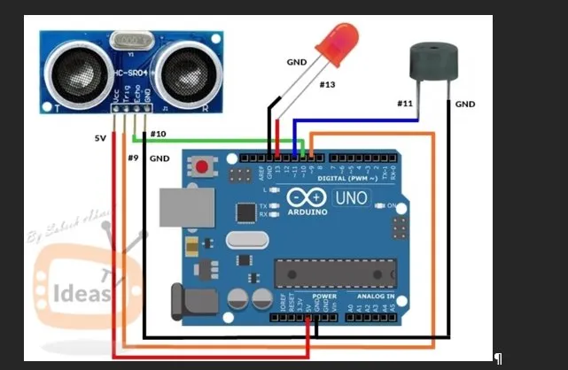

# 🦯 Projet Canne Blanche Électronique


> **Cadre :** Projet de fin de formation — CRM Mulhouse  
> **Réalisé en binôme**  
> **Prototype offert à un collègue stagiaire aveugle du CRM**

---

## 🎯 Objectif

Concevoir et fabriquer une **canne blanche électronique** permettant à une personne malvoyante ou aveugle d'être avertie par **vibration et signal sonore** de la présence d'obstacles à proximité, grâce à un capteur ultrasonique HC-SR04 monté sur une carte Arduino UNO.

---

## 📋 Contexte — La canne blanche

La canne blanche est une aide technique destinée aux personnes déficientes visuelles. Elle remplit plusieurs fonctions :

| Fonction | Description |
|----------|-------------|
| **Signalement** | Avertit les passants et automobilistes de la déficience visuelle |
| **Détection** | Explore l'espace devant la personne, décèle les obstacles bas |
| **Protection** | Évite le contact direct avec les obstacles en intérieur |
| **Contrôle** | Étaye le visuel, rassure dans les situations particulières |
| **Appui** | Pour les personnes ayant des troubles de l'équilibre |

La **canne blanche électronique** enrichit ces fonctions avec une détection active des obstacles par capteur ultrasonique, transmettant l'information par vibration et/ou son.

---

## 🛠️ Matériel utilisé

| Composant | Rôle |
|-----------|------|
| Arduino UNO | Microcontrôleur central |
| HC-SR04 | Capteur ultrasonique — mesure de distance |
| Buzzer DC | Signal sonore d'alerte obstacle |
| LED | Signal lumineux d'alerte |
| Tube PVC | Structure physique de la canne |
| Câbles Jumper | Connexions électroniques |
| Batterie 9V rechargeable | Alimentation autonome |
| Connecteur batterie | Interface alimentation |
| Serre-câbles | Maintien des composants |

---

## 🔌 Schéma électronique

Schéma réalisé sur **Tinkercad** :



🔗 [Voir le schéma Tinkercad interactif](https://www.tinkercad.com/things/eVnVbN7L00f-projet-canne)

**Câblage :**
```
Arduino UNO
├── Pin 9  → trigPin  (HC-SR04 TRIG)
├── Pin 10 → echoPin  (HC-SR04 ECHO)
├── Pin 11 → Buzzer
└── Pin 13 → LED
```

---

## 💻 Code Arduino (C++)

```cpp
// Canne Blanche Électronique — CRM Mulhouse
// Détection d'obstacles par ultrason HC-SR04

// Définition des broches
const int trigPin = 9;
const int echoPin = 10;
const int buzzer  = 11;
const int ledPin  = 13;

// Variables
long duration;
int distance;
int safetyDistance;

void setup() {
  pinMode(trigPin, OUTPUT);
  pinMode(echoPin, INPUT);
  pinMode(buzzer,  OUTPUT);
  pinMode(ledPin,  OUTPUT);
  Serial.begin(9600);
}

void loop() {
  // Déclenchement de l'impulsion ultrasonique
  digitalWrite(trigPin, LOW);
  delayMicroseconds(2);
  digitalWrite(trigPin, HIGH);
  delayMicroseconds(10);
  digitalWrite(trigPin, LOW);

  // Lecture du temps de retour
  duration = pulseIn(echoPin, HIGH);

  // Calcul de la distance (cm)
  distance = duration * 0.034 / 2;
  safetyDistance = distance;

  // Alerte si obstacle à moins de 5 cm
  if (safetyDistance <= 5) {
    digitalWrite(buzzer, HIGH);
    digitalWrite(ledPin, HIGH);
  } else {
    digitalWrite(buzzer, LOW);
    digitalWrite(ledPin, LOW);
  }

  // Affichage sur le moniteur série
  Serial.print("Distance: ");
  Serial.println(distance);
}
```

### Principe de fonctionnement

1. Le capteur HC-SR04 émet une impulsion ultrasonique
2. Il mesure le temps de retour de l'écho
3. La distance est calculée : `distance = durée × 0.034 / 2`
4. Si obstacle détecté à ≤ 5 cm → buzzer + LED activés
5. Affichage de la distance en temps réel sur le moniteur série

---

## 📐 Conception physique

- Structure en **tube PVC** reproduisant la forme d'une canne
- Capteur HC-SR04 placé en tête de canne, orienté vers l'avant
- Boîtier Arduino intégré dans la canne
- Batterie 9V rechargeable pour autonomie nomade
- Câbles maintenus par serre-câbles pour robustesse

---

## ✅ Résultats & Validation

| Critère | Résultat |
|---------|----------|
| Détection d'obstacles | ✅ Fonctionnelle |
| Alerte sonore | ✅ Buzzer actif |
| Alerte visuelle | ✅ LED active |
| Autonomie batterie | ✅ 9V rechargeable |
| Validation professionnelle | ✅ Validé par fabricant professionnel |
| Destination finale | 🎁 Offert à un collègue stagiaire aveugle |

---

## 📚 Sources & références

- Cahier des charges — CRM Mulhouse
- [Schéma Tinkercad du projet](https://www.tinkercad.com/things/eVnVbN7L00f-projet-canne)
- Documentation technique HC-SR04
- Projet Lions Club — Canne blanche électronique (René Farcy, CNRS)

---

*Projet réalisé dans le cadre de la formation TRI RNCP35295 — CRM Mulhouse*